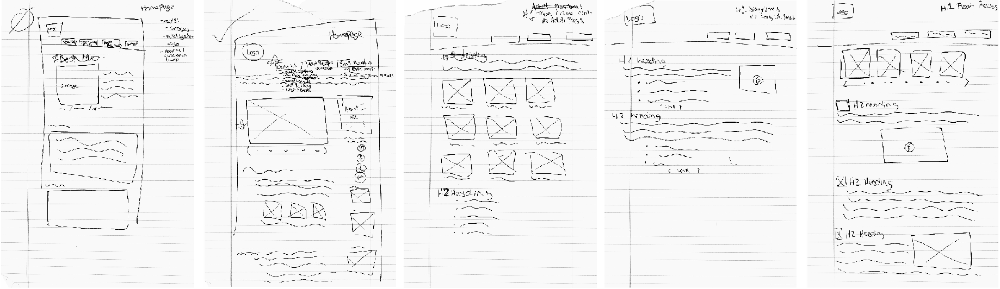
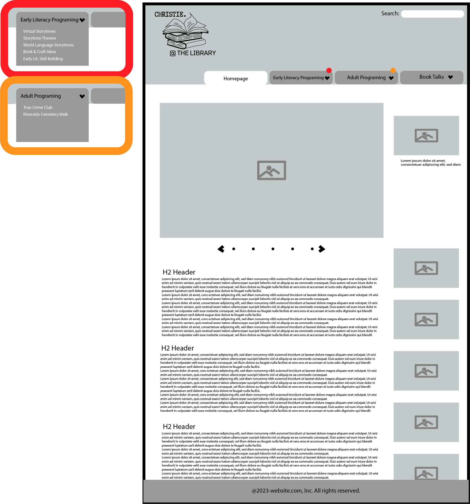
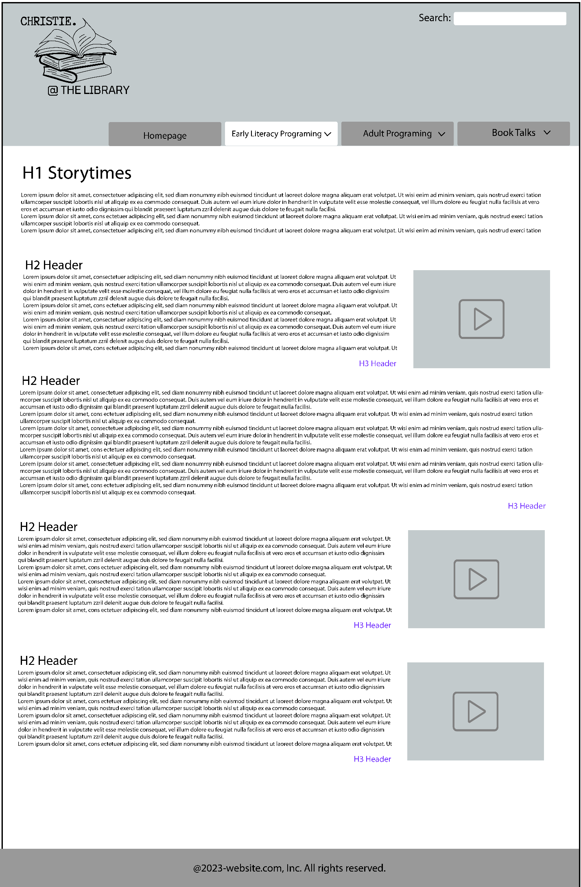
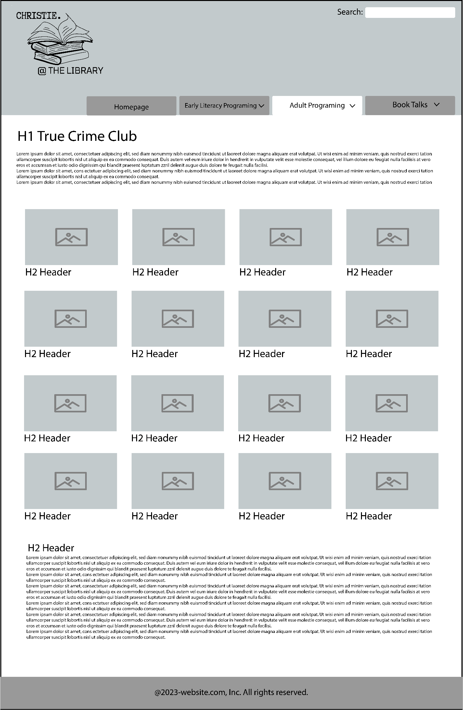
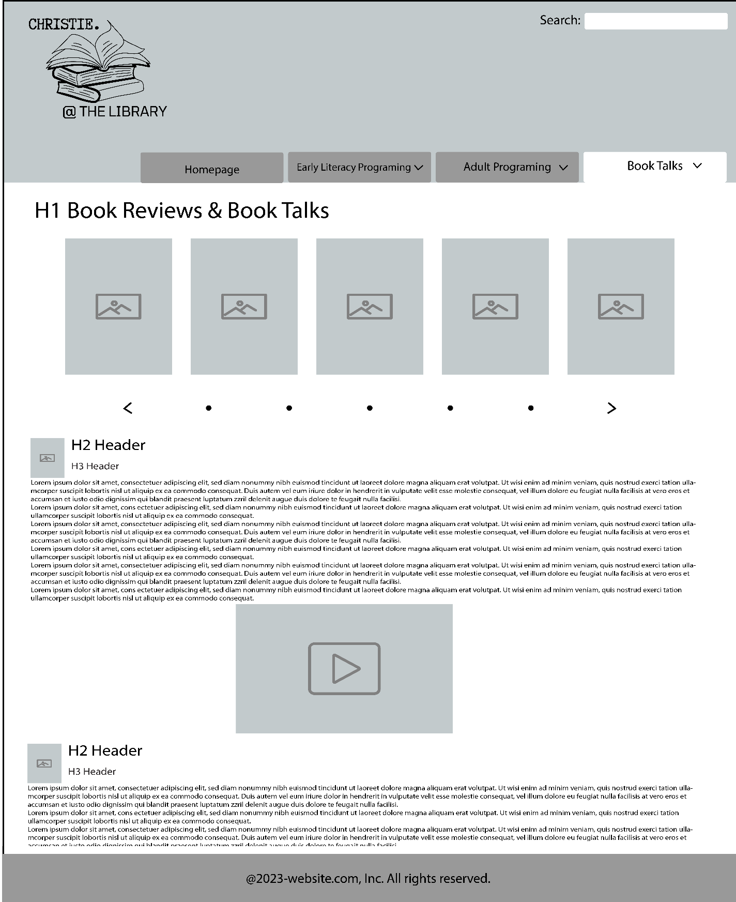

# Christie Folsom's INF 6420 Project

A portfolio site showcasing my work as a youth services librarian and sharing it with others.

## Wireframes

I have worked on several wireframes to outline the possible layout of my site and what some of my pages will look like. 

The first thing I did was create a few pen and paper wireframe sketches to get out all my ideas.

After sketching out ideas, I created more detailed wireframes for my website using Adobe Illustrator. 

**Homepage**

Header- will include my logo and navigation menu

Navigation Menu - will include links to other pages on my website including pages for early literacy programs, adult programs and book talks. I intend to include a drop down menu within the navigation page for more detailed pages within each of these categories

Main Content - will include a short blurb about myself, a picture carousel highlighting my best work, blog entries detaling my favorite projects

Right Hand Side Bar - will include my contact information and other important links

Footer- will include copyright information

**Storytime Page**

Header- will include my logo and navigation menu

Navigation Menu - will include links to other pages on my website including pages for my homepage, adult programs and book talks. 

Main Content - will be sharing early literacy library programming information, specifically focusing storytime programs I have created and including some example storytime videos I have filmed

Footer- will include copyright information

**True Crime Club Page**

Header- will include my logo and navigation menu

Navigation Menu - will include links to other pages on my website including pages for my homepage, early literacy programs and book talks

Main Content - will be sharing adult library programming information for the true crime book club I run at my library. it will consist of images, text and links to more detailed information on each true crime case we have researched

Footer- will include copyright information

**Book Talk Page**

Header- will include my logo and navigation menu

Navigation Menu - will include links to other pages on my website including pages for My homepage, early literacy programs and adult programs

Main Content - will be sharing library related book talks and reviews. a picture carousel will highlight the most recently reviews books, with more detailed sections of text, photos or videos on each book listed below.

Footer- will include copyright information